# 🐝 VibeHive

**Share the vibe. Join the hive.**

VibeHive is a mini social media web app. Members create profiles, share posts tagged with a mood ("vibe"), like and comment on posts, follow each other, and find new people and topics on the Explore page.

The frontend is plain HTML, CSS and JavaScript. The backend is a JSON REST API built with Django REST Framework, backed by SQLite.

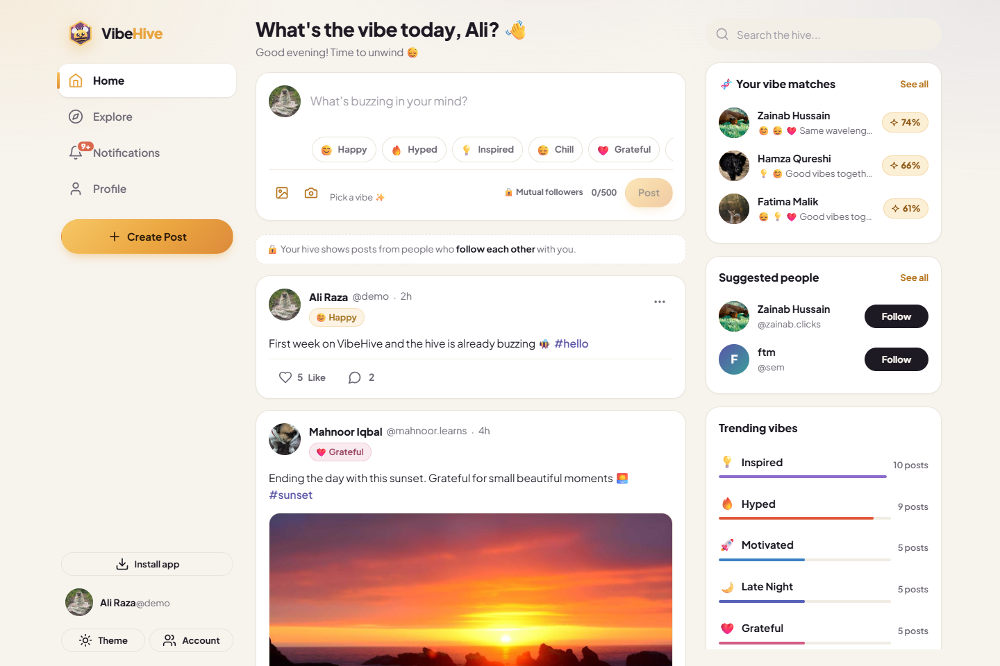

---

## 🧬 Signature features: why VibeHive is different

Most social apps connect you through **who you already know**. VibeHive connects you through **how you feel**.

### 🤝 Vibe Match
Every member builds a "vibe DNA" from the moods they tag on their posts. VibeHive compares two members' DNA and shows how compatible they are:

- A **match score ring** on other people's profiles (for example *70% · Same wavelength 🌊*), a sentence about the vibes you share, and side-by-side **vibe DNA bars**
- **"People who share your vibe"** on Explore: members ranked by match score, with the vibes you have in common
- A **"Your vibe matches"** widget in the home sidebar, and a **Your Vibe DNA** card on your own profile
- Match levels: 💞 Vibe twins · 🌊 Same wavelength · ✨ Good vibes together · 🌗 Complementary vibes · 🧲 Opposite energies

**How it works:** each member is a vector of vibe counts (for example `{chill: 12, happy: 8, inspired: 5}`). The score is the **cosine similarity** of the two vectors, so it compares the *mix* of moods rather than how much someone posts. A member with 10 posts can still be a 90% match with someone who has 200. You need at least 2 posts with a vibe before matches appear.


### 🗓️ Vibe Calendar
Every profile has a "year in pixels" grid of the last 6 months:

- **Each square is a day**, coloured by the vibe posted most that day. Darker squares mean more posts.
- Hover or focus a square for details (for example *Sat, Sep 19 · 3 posts · 😌 Chill ×2 · 😊 Happy*)
- Stats: **top vibe**, **this month's vibe**, **active days** and **best streak**
- Days follow the viewer's local time zone, the calendar updates as soon as you post, and on phones it scrolls sideways

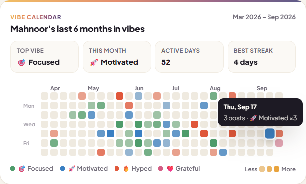

### 🎨 The "Hive Dusk" palette
The colours follow the brand: honey light fading into a dusk sky.

| Honey | Ember | Mulberry | Dusk indigo |
|---|---|---|---|
| `#E8A33D` | `#D9694F` | `#8A4E73` | `#3E3D73` |

- Warm **parchment** backgrounds (`#F7F4EE`) in light mode and warm **ink** (`#121016`) in dark mode, instead of the usual cold greys
- A fine **film-grain texture** on gradients so they look printed rather than flat
- The nine vibe colours are softened jewel tones tuned to the palette, so posts, badges and the calendar feel like one system

---

## 📱 Use it on your phone

VibeHive works as a website, an **installable app (PWA)** and a **native Android app**, all from the same frontend code.

- **Stay signed in:** reopening VibeHive takes you straight back to your own feed and profile.
- **Saved accounts:** everyone who logs in on a device is remembered, just like Instagram's account switcher. The login screen shows *"Choose an account to continue"*, and the 👥 **Account** menu lets you switch accounts in one tap, add another account, or log out. Logging out keeps the account listed but asks for the password next time, and ✕ removes it from the device.
- **Installable PWA:** a manifest, app icons and a service worker give you an **Install app** button, a home-screen icon, full-screen mode, instant loading and a friendly offline screen.
- **Android app:** the `mobile/` folder wraps the frontend with **Capacitor** and builds a real `.apk` in Android Studio.

👉 **[DEPLOY.md](DEPLOY.md)** walks through putting VibeHive online for free on PythonAnywhere, installing it on a phone and building the APK, step by step.

---

## ✨ Features

**Accounts and security**
- Register, log in (with username **or** email) and log out
- Django password validators: minimum length, common-password check, not all-numeric, not too similar to the username
- Passwords are hashed with Django's PBKDF2 hasher
- Token authentication, and every app page redirects to login when you are signed out
- Checks both in the browser and on the server, with errors shown next to the field that caused them

**Profiles**
- Avatar (uploaded photo, or colourful initials if there is none), full name, @username, bio and join date
- Post, follower and following counts. Click a count to open that list.
- Follow / Unfollow button on other people's profiles, and a "Follows you" badge
- Edit profile modal: upload or remove a photo, change your name and bio

**Posts and comments**
- Composer with an optional vibe, optional image (checked before upload, 5 MB max), a character counter (500 max) and a Post button that stays disabled until there is text or an image
- `#hashtags` and links become clickable automatically
- Edit and delete your own posts. Other people's posts show no edit or delete controls, and the API returns 403 if someone tries anyway.
- Comments load when you open them. You can delete your own.
- Infinite-scroll feed with loading skeletons

**Privacy: mutual followers only** 🔒
- You see **your own posts** plus posts from people you **follow each other** with, like Facebook friends.
- A one-way follow isn't enough. Once they follow you back, their posts, Vibe Calendar and vibe DNA unlock.
- Profiles of other people still show their name, photo, bio, counts and a Follow button, but posts show *"🔒 …'s vibes are for their hive"*.
- The rule is enforced by the **API** (feeds, profiles, hashtags, explore, single-post links, likes and comments), not just hidden in the page.

**Private chat** 💬
- **Messages page** with all your chats (photo, name, last message, time, unread count), live search and a **New chat** button
- **Chat screen** with speech bubbles (yours in honey on the right, theirs on the left), day separators and times
- **Only people who follow each other can chat.** If someone unfollows, the history stays but new messages are blocked
- **Message** button on the profile of anyone you follow each other with
- **📷 Photos** from the gallery or camera, **🎯 vibe messages** with a colourful vibe badge
- **Reactions:** double-tap for ❤️, or long-press / right-click to pick ❤️ 😂 🔥 😮 😢 👍
- **Seen ✓✓**, a **"typing…"** indicator, **delete your own messages**, and **load earlier messages**
- **Unread badge** on 💬 in the menu and bottom bar, plus pop-ups like *"💬 Zainab: are you coming?"*
- Updates every 2.5 seconds while a chat is open (PythonAnywhere's free plan has no WebSockets, so it polls instead)

**Live notifications** 🔔
- While the app is open it checks for new activity every 20 seconds (and pauses in the background).
- New likes, comments and follows pop up on screen, e.g. *"🤝 Omar followed you back — you can now see each other's vibes"*. Tap the pop-up to open it.
- A number badge appears on the 🔔 bell and in the browser tab title, like **(3)**, and clears when you open Notifications.

**Camera** 📷
- The 📷 button in the post box opens the **camera app** on phones and a **live webcam preview** with a shutter button on laptops (with Flip for front/back cameras).
- Big phone photos (even 12 MB) are resized automatically before upload, so they post quickly and stay under the 5 MB limit.

**Likes and follows**
- Like and Unlike update the button straight away, with a heart and bee burst animation. If the request fails, the change is undone.
- The database rejects duplicate likes and duplicate follows (unique constraints), and you cannot follow yourself (check constraint plus an API check)

**Discovery and activity**
- **Home**: a "Your hive" feed (you and the people you follow) and an "Everyone" feed
- **Explore the Hive**: user search, filter by vibe, trending topics, suggested creators, newest members and popular recent posts
- **Search** by username or full name, as a live dropdown in the sidebar or as a full results list on Explore
- **Notifications**: likes and comments on your posts and new followers, with a "Follow back" button and an unread dot
- **Single post page** (`post.html?id=…`) with comments already open

**The VibeHive identity**
- Nine vibes, each with its own colour: 😊 Happy · 🔥 Hyped · 💡 Inspired · 😌 Chill · ❤️ Grateful · 🎯 Focused · 😂 Funny · 🌙 Late Night · 🚀 Motivated
- The "Hive Dusk" palette (honey → ember → mulberry → dusk indigo), a hexagon logo, honeycomb patterns, and bee-themed empty states and messages
- Custom toast notifications (the app never uses `alert()`)
- Light and dark mode, remembered in `localStorage`, with no flash of the wrong theme when a page loads
- Responsive layout: 3 columns on desktop, 2 on tablet (icon-only sidebar), and a single column on mobile with a fixed bottom nav and bottom-sheet modals
- Keyboard shortcuts: press `N` to create a post and `Ctrl/⌘ + Enter` to publish it

---

## 📸 Screenshots

| Login (animated showcase) | Home feed |
|---|---|
| 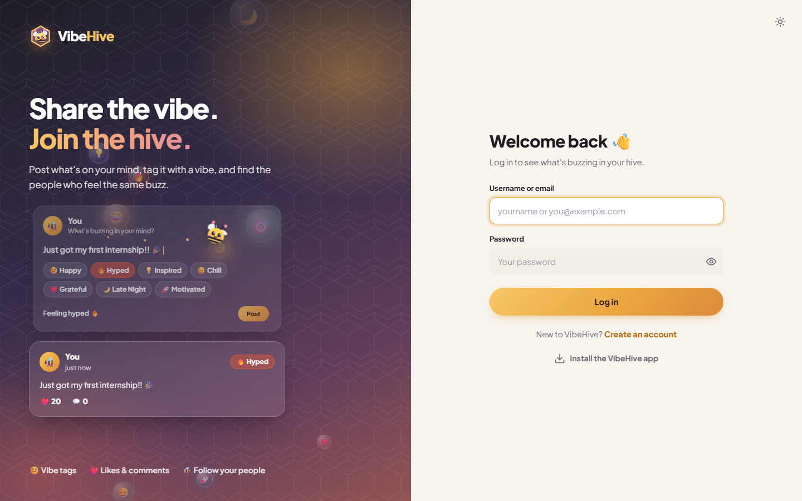 |  |

| Explore the Hive | Profile with Vibe Match & Vibe Calendar |
|---|---|
| 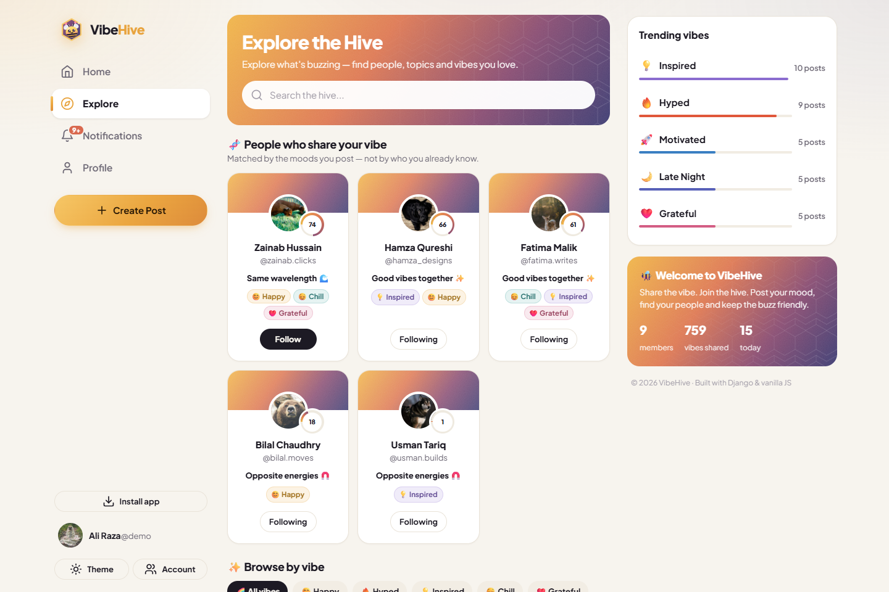 | 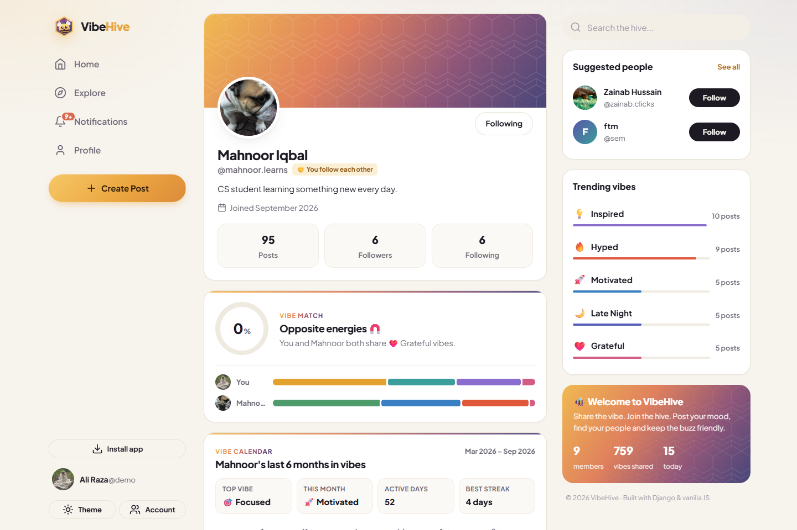 |

| Private profile (not mutual followers) | Notifications |
|---|---|
| 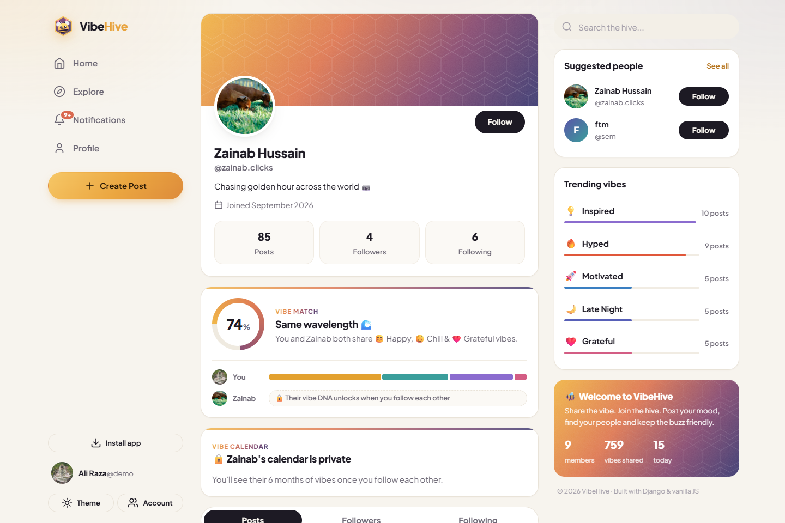 | 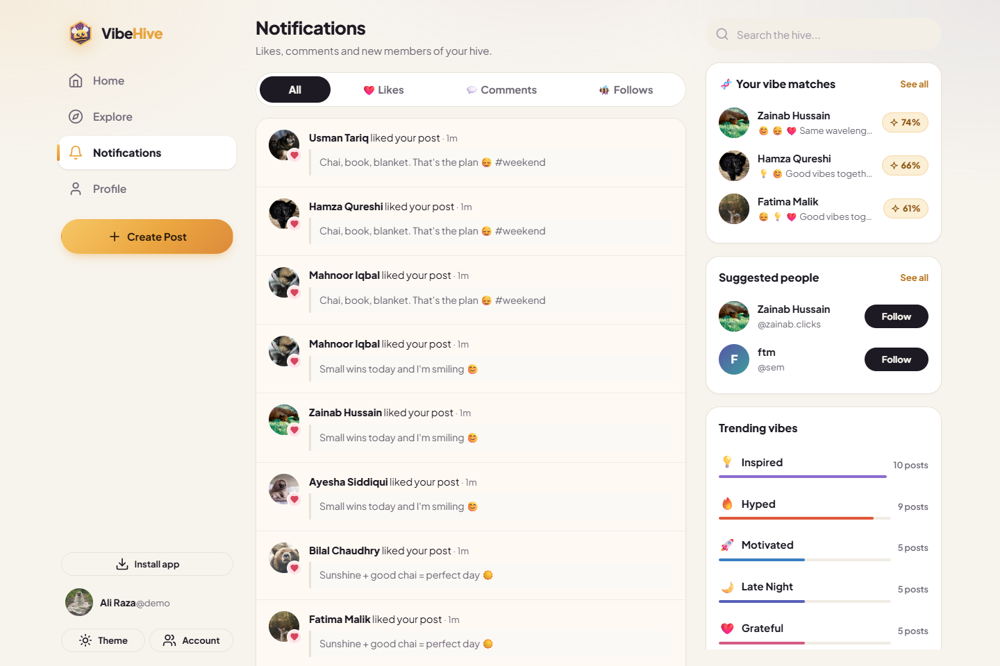 |

| Live notification pop-up | Create post |
|---|---|
| 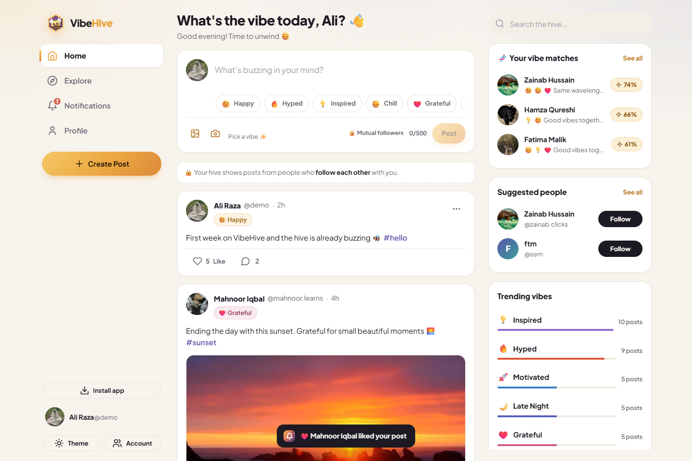 | 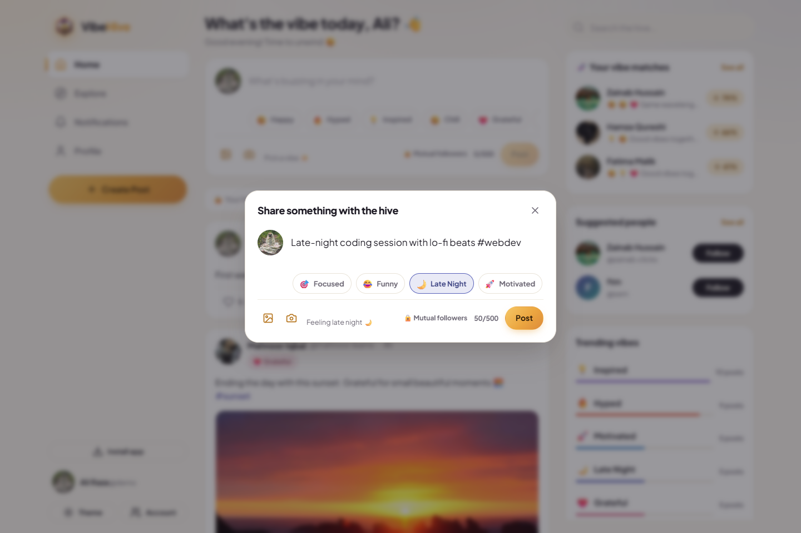 |

| Private chat | Mobile chats |
|---|---|
| 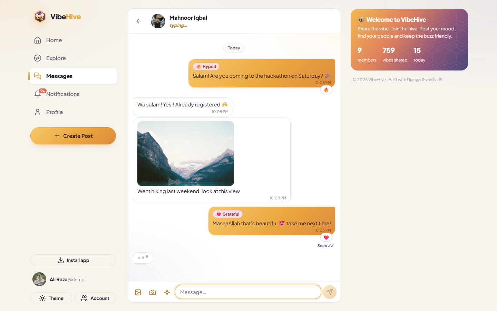 | 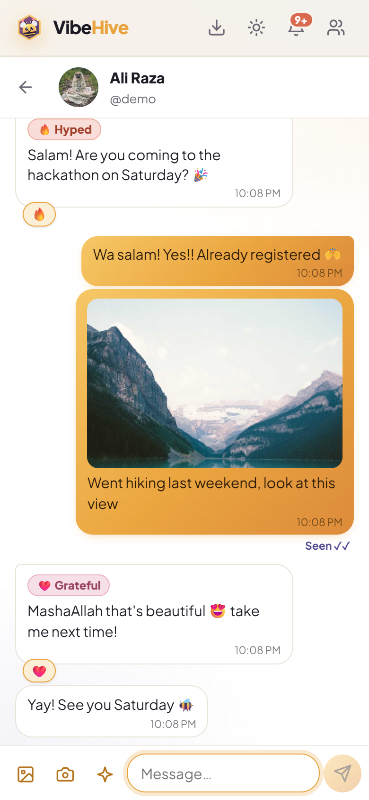 |

| Camera | Dark mode |
|---|---|
| 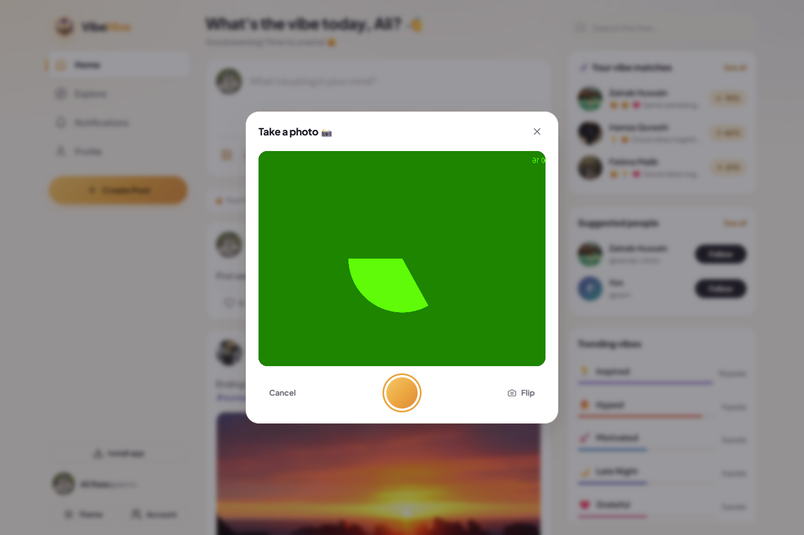 | 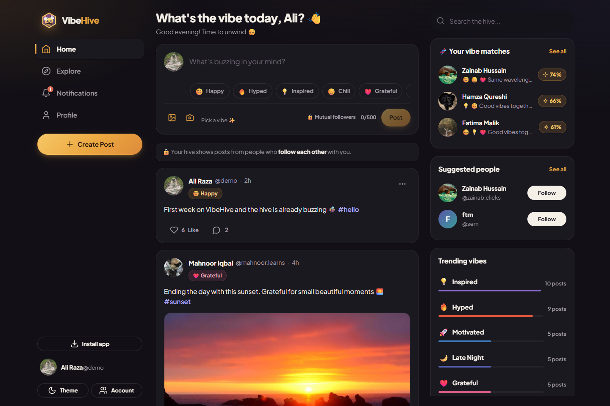 |

| Mobile login | Mobile feed | Mobile profile |
|---|---|---|
| 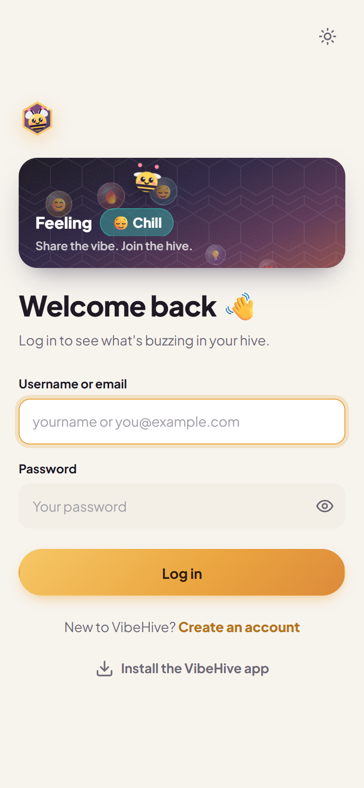 | 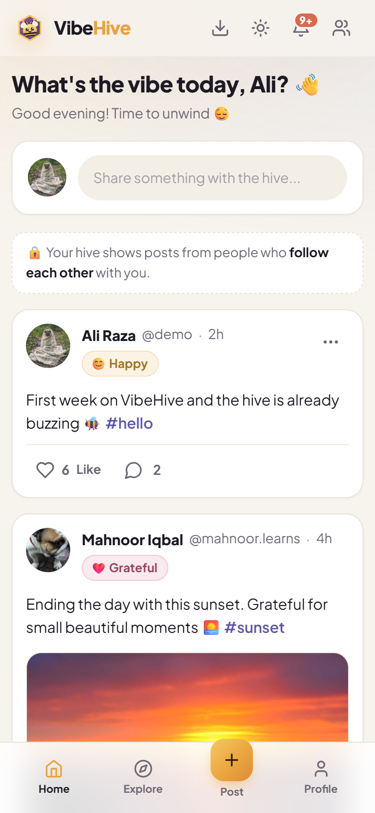 | 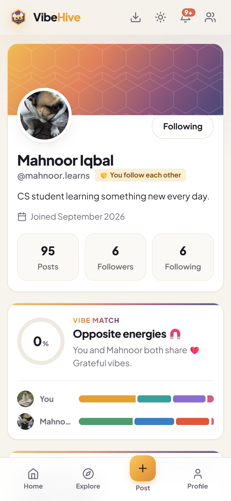 |

> The screenshots use the demo data from `python manage.py seed_demo`: 8 fictional members with Pakistani names, cute-animal profile pictures, nature photos from around the world, and 6 months of posts so every Vibe Calendar has colour.
> The photos are free-to-use [Unsplash](https://unsplash.com/license) images (via Lorem Picsum) bundled in `backend/posts/management/commands/seed_assets/`. Every photographer is credited in [`CREDITS.md`](backend/posts/management/commands/seed_assets/CREDITS.md).

---

## 🧰 Technology stack

| Layer | Technology |
|---|---|
| Frontend | HTML5, CSS3 (custom design system with CSS variables, no framework), vanilla JavaScript (ES2020) |
| Backend | Python 3.10+, Django 5, Django REST Framework, django-cors-headers |
| Auth | DRF token authentication (`Authorization: Token <key>`) |
| Database | SQLite |
| Images | Pillow (validates uploads and generates the demo images) |
| Font | Plus Jakarta Sans (Google Fonts) |
| Serving | WhiteNoise (the frontend and admin files are served by the same Django app) |
| Mobile | PWA (manifest + service worker) and Capacitor 6 (Android) |

---

## 📁 Project structure

```
VibeHive/
├── backend/
│   ├── manage.py
│   ├── requirements.txt
│   ├── .env.example           # settings template for the live server
│   ├── vibehive/              # project settings + root URLs
│   │   ├── settings.py
│   │   └── urls.py
│   ├── users/                 # auth, profiles, follow system, search
│   │   ├── models.py          # Profile, Follow
│   │   ├── serializers.py
│   │   ├── views.py
│   │   ├── queries.py         # annotated querysets (counts, follow state)
│   │   ├── signals.py         # auto-create Profile for each new User
│   │   ├── urls.py
│   │   └── tests.py
│   ├── chat/                  # private 1-to-1 chat: Conversation, Message, Reaction
│   ├── posts/                 # posts, comments, likes, trending, notifications
│   │   ├── models.py          # Post, Comment, Like, Vibe choices
│   │   ├── serializers.py
│   │   ├── views.py
│   │   ├── permissions.py     # IsAuthorOrReadOnly
│   │   ├── vibes.py           # Vibe Match + Vibe Calendar logic
│   │   ├── urls.py
│   │   ├── tests.py
│   │   └── management/commands/
│   │       ├── seed_demo.py   # demo members, posts, likes, follows
│   │       └── seed_assets/   # bundled demo photos + CREDITS.md
│   └── db.sqlite3             # created by `migrate`
│
├── frontend/
│   ├── index.html             # home feed
│   ├── login.html
│   ├── register.html
│   ├── profile.html
│   ├── explore.html
│   ├── notifications.html
│   ├── post.html              # single post
│   ├── messages.html          # chat list
│   ├── chat.html              # one chat
│   ├── offline.html           # shown by the service worker when offline
│   ├── manifest.webmanifest   # PWA: name, icons, colours
│   ├── sw.js                  # PWA: service worker (caching + offline)
│   ├── assets/                # favicon + app icons
│   ├── css/style.css
│   └── js/
│       ├── theme-boot.js      # applies the saved theme before first paint
│       ├── config.js          # where the API lives (set your live URL here for the app)
│       ├── api.js             # REST client, token + saved-accounts storage
│       ├── pwa.js             # registers the service worker, "Install app" button
│       ├── app.js             # shared shell, helpers, toasts, modals, composer, follow
│       ├── posts.js           # post cards, likes, comments, feeds
│       ├── vibes.js           # Vibe Match + Vibe Calendar UI
│       ├── messages.js        # chat list + new chat
│       ├── chat.js            # chat screen: bubbles, photos, reactions, typing, seen
│       ├── auth.js            # login + register
│       ├── feed.js            # home page
│       ├── explore.js
│       ├── profile.js
│       ├── notifications.js
│       └── post.js
│
├── mobile/                    # Android app (Capacitor)
│   ├── capacitor.config.json
│   ├── copy-web.js            # copies ../frontend into the app
│   └── android/               # Android Studio project
│
├── docs/screenshots/
├── DEPLOY.md                  # go live + phone install + APK guide
├── README.md
└── .gitignore
```

---

## 🗃️ Database models

```
User (django.contrib.auth)
 ├── Profile      1–1   full_name, bio, avatar
 ├── Post         1–N   content, image, vibe, created_at
 │    ├── Comment 1–N   author, content, created_at
 │    └── Like    1–N   user          UNIQUE (user, post)
 └── Follow       N–N   follower → following
                        UNIQUE (follower, following), CHECK follower ≠ following
```

| Model | Key fields | Notes |
|---|---|---|
| `Profile` | `user` (1–1), `full_name`, `bio`, `avatar` | Created automatically by a `post_save` signal |
| `Follow` | `follower` → User, `following` → User, `created_at` | Unique pair, and you cannot follow yourself |
| `Post` | `author`, `content` (≤500), `image`, `vibe`, `created_at` | `vibe` uses the `Vibe` TextChoices |
| `Comment` | `post`, `author`, `content` (≤300), `created_at` | |
| `Like` | `user`, `post`, `created_at` | Unique pair, so a user can like a post only once |

Counts (likes, comments, followers, posts) and flags like `is_liked` and `is_following` are worked out in SQL with subqueries. This avoids running one extra query per item in a list (the N+1 problem).

---

## 🔌 API endpoints

Every endpoint except register and login needs the header `Authorization: Token <key>`.

| Method | Endpoint | Description |
|---|---|---|
| POST | `/api/register/` | Create account → `{token, user}` |
| POST | `/api/login/` | `{identifier, password}` → `{token, user}` |
| POST | `/api/logout/` | Revoke token |
| GET | `/api/profile/` | Current user's profile |
| PUT / PATCH | `/api/profile/` | Update `full_name`, `bio`, `avatar`, `remove_avatar` (multipart) |
| GET | `/api/users/` | All members (`?suggested=1` = people you don't follow yet) |
| GET | `/api/users/{id}/` | Public profile |
| GET | `/api/users/{id}/followers/` | Followers list |
| GET | `/api/users/{id}/following/` | Following list |
| POST / DELETE | `/api/users/{id}/follow/` | Follow / unfollow |
| GET | `/api/search/users/?q=` | Search by username or full name |
| GET | `/api/posts/` | Posts. Filters: `feed=following`, `author=<id>`, `vibe=<key>`, `tag=<hashtag>`, `sort=popular` |
| POST | `/api/posts/` | Create (multipart: `content`, `vibe`, `image`) |
| GET | `/api/posts/{id}/` | Single post |
| PATCH | `/api/posts/{id}/` | Edit your own post |
| DELETE | `/api/posts/{id}/` | Delete your own post |
| POST / DELETE | `/api/posts/{id}/like/` | Like / unlike → `{liked, like_count}` |
| GET / POST | `/api/posts/{id}/comments/` | List / add comments |
| DELETE | `/api/comments/{id}/` | Delete your own comment |
| GET | `/api/trending/` | Top vibes, top hashtags and hive stats |
| GET | `/api/vibes/` | Available vibes |
| GET | `/api/notifications/` | Recent likes, comments and follows on your content |
| GET / POST | `/api/chats/` | Your chats / open a chat with a mutual follower `{user_id}` |
| GET | `/api/chats/contacts/` | People you can message (mutual followers) |
| GET | `/api/chats/unread/` | Unread total + newest unread messages |
| GET / POST | `/api/chats/{id}/messages/` | Latest 40 messages (`?before=<id>` for older) / send (multipart: `text`, `image`, `vibe`) |
| POST | `/api/chats/{id}/typing/` | "I'm typing" (lasts 5 seconds) |
| DELETE | `/api/messages/{id}/` | Delete your own message |
| POST | `/api/messages/{id}/react/` | React `{emoji}`; the same emoji again removes it |
| GET | `/api/users/{id}/vibe-match/` | Your match score with a member, shared vibes and both vibe DNAs |
| GET | `/api/vibe-matches/?limit=6` | Members whose vibes match yours best |
| GET | `/api/users/{id}/vibe-calendar/?weeks=26&tz=` | Daily vibe activity + summary for the Vibe Calendar |

Lists are paginated (`?page=`, 10 per page) and return `{count, next, previous, results}`.

---

## 🚀 Installation

**Requirements:** Python 3.10+ and pip.

```bash
git clone <your-repo-url> VibeHive
cd VibeHive/backend

# (recommended) create a virtual environment
python -m venv venv
# Windows:  venv\Scripts\activate
# macOS/Linux:  source venv/bin/activate

pip install -r requirements.txt
python manage.py migrate
python manage.py seed_demo          # optional: fictional demo members & posts
python manage.py seed_demo --remove # delete ONLY the demo members again (real accounts stay)
python manage.py createsuperuser    # optional: for /admin/
```

## ▶️ How to run the backend

```bash
cd backend
python manage.py runserver
```

The API runs at `http://127.0.0.1:8000/api/` and the Django admin at `http://127.0.0.1:8000/admin/`.

## 🌐 How to run the frontend

**Option A (easiest):** in development, Django also serves the `frontend/` folder. With the backend running, open **http://127.0.0.1:8000/**.

Django serves the frontend with WhiteNoise, so the same single server also works on the live site.

**Option B (separate static server):** the frontend is plain static files, so any static server works:

```bash
cd frontend
python -m http.server 5500
```

Then open **http://127.0.0.1:5500/**. The frontend sends its requests to `http://127.0.0.1:8000`, and CORS allows this in development. The API address is chosen in `frontend/js/config.js`.

**On your phone (same Wi-Fi):** run `python manage.py runserver 0.0.0.0:8000`, add your laptop's IP (for example `192.168.1.5`) to `DJANGO_ALLOWED_HOSTS` in `backend/.env`, then open `http://192.168.1.5:8000` on the phone. For an installable app, follow [DEPLOY.md](DEPLOY.md).

**Demo login** (after `seed_demo`): username `demo`, password `HiveDemo2026!`. All the other seeded members use the same password.

## 🧪 Running the tests

```bash
cd backend
python manage.py test
```

The 38 API tests cover registration and validation, login and logout, protected routes, follow rules (no duplicates, no self-follow), unique likes, who may edit or delete posts and comments, feed filters, search, notifications, trending, Vibe Match scoring (twins = 100%, opposites = 0%, locked until you post enough vibes) and Vibe Calendar grouping and streaks.

---

## 🔐 Security notes

- Passwords are hashed with Django's default hasher and checked by `AUTH_PASSWORD_VALIDATORS`.
- The API uses token authentication in the `Authorization` header. Browsers never attach that header on their own, so the API cannot be hit by CSRF attacks. The Django admin still uses sessions with CSRF protection.
- Object-level permission (`IsAuthorOrReadOnly`) means only the author can edit or delete a post or comment.
- Database constraints stop duplicate likes, duplicate follows and self-follows, even if two requests arrive at the same moment.
- Uploads must be real images (checked by Pillow) and no larger than 5 MB.
- Emails are private: a profile only includes the email when you are viewing your own.
- The frontend escapes all user text before displaying it, to prevent cross-site scripting (XSS).
- Unauthenticated visitors are rate-limited (60 requests/minute).
- **On the live server** (`DJANGO_DEBUG=0`): the secret key and hosts come from `backend/.env`, cookies are HTTPS-only, and CORS only allows the site itself and the Android app (`https://localhost`). See [DEPLOY.md](DEPLOY.md).
- Saved accounts keep each account's token in the device's `localStorage`. Logging out revokes the token on the server, and ✕ removes the account from the device completely.

---

## 🔮 Future improvements

- Real-time notifications with WebSockets (Django Channels)
- Several images per post, and videos
- Private accounts and follow requests
- @mentions with autocomplete
- Bookmarks and reposts
- Password reset by email and email verification
- PostgreSQL and cloud media storage (e.g. S3) for production
- Direct messages between members
- Content reporting and moderation tools

---

## 👤 Author

**Semal fatima** · [GitHub](https://github.com/semal-ftm) · [LinkedIn](https://linkedin.com/in/Semal Fatima)

## 🎓 Internship project note

I built VibeHive for **Task 2: Social Media Platform** of my internship. The task asked for user profiles, posts and comments, and a like/follow system, with an HTML/CSS/JavaScript frontend, a Django or Express.js backend, and a database for users, posts, comments and followers. VibeHive covers all of these, and adds two original features built on the vibe system, **Vibe Match** and the **Vibe Calendar**, plus Explore, search, notifications, dark mode and a responsive layout.
